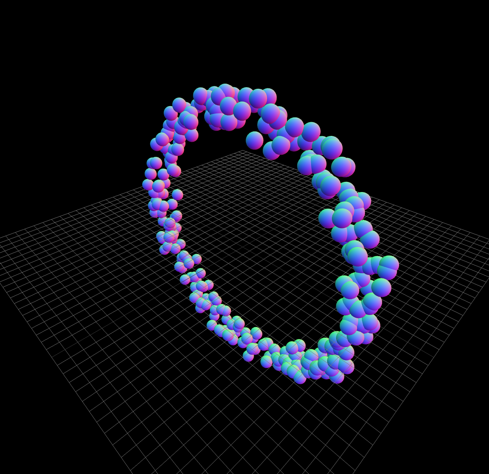
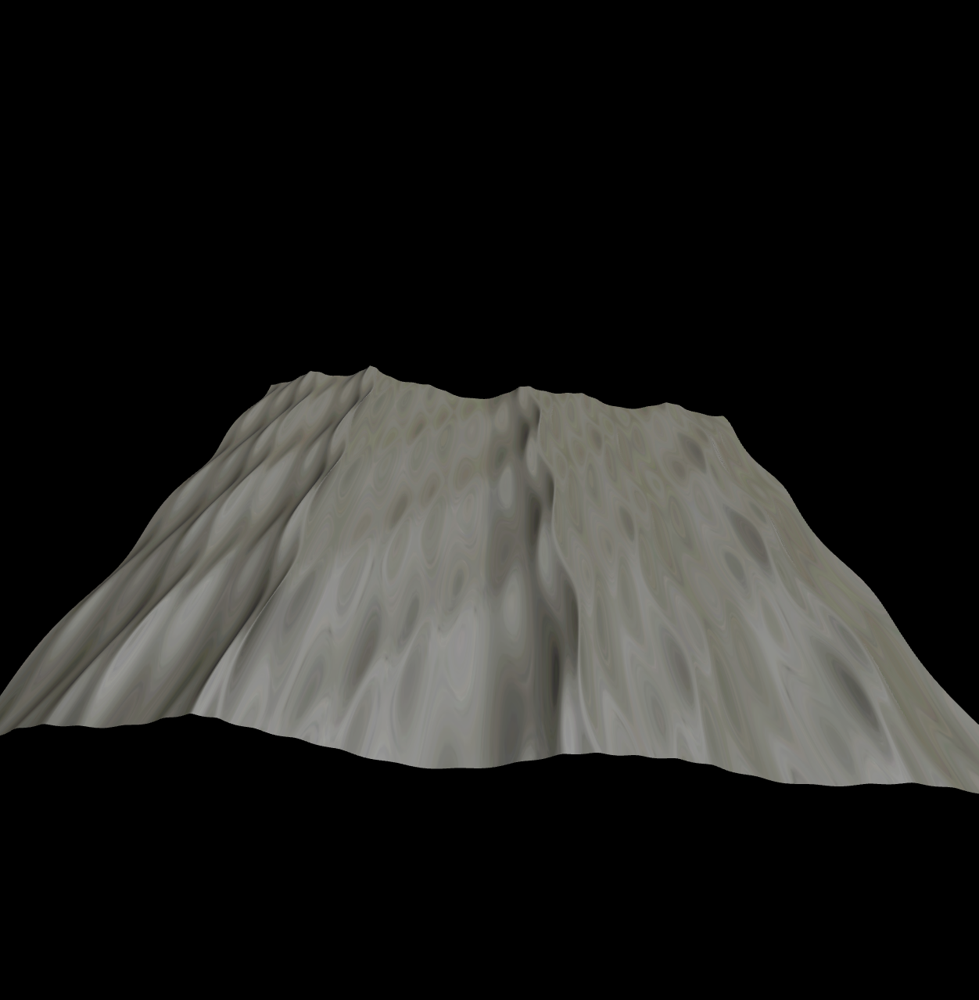
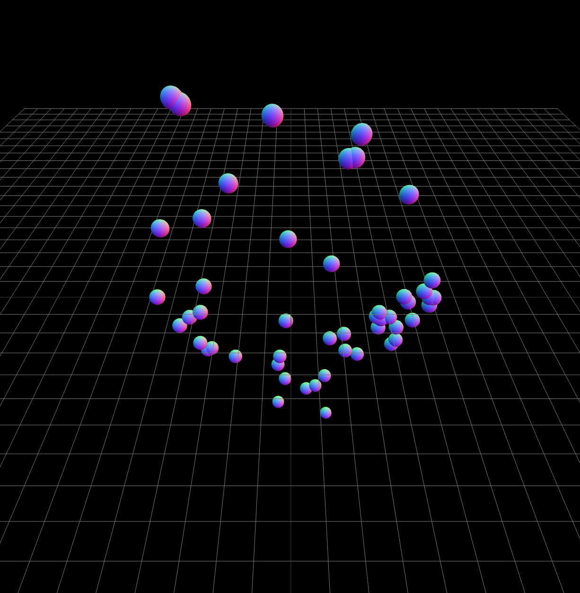
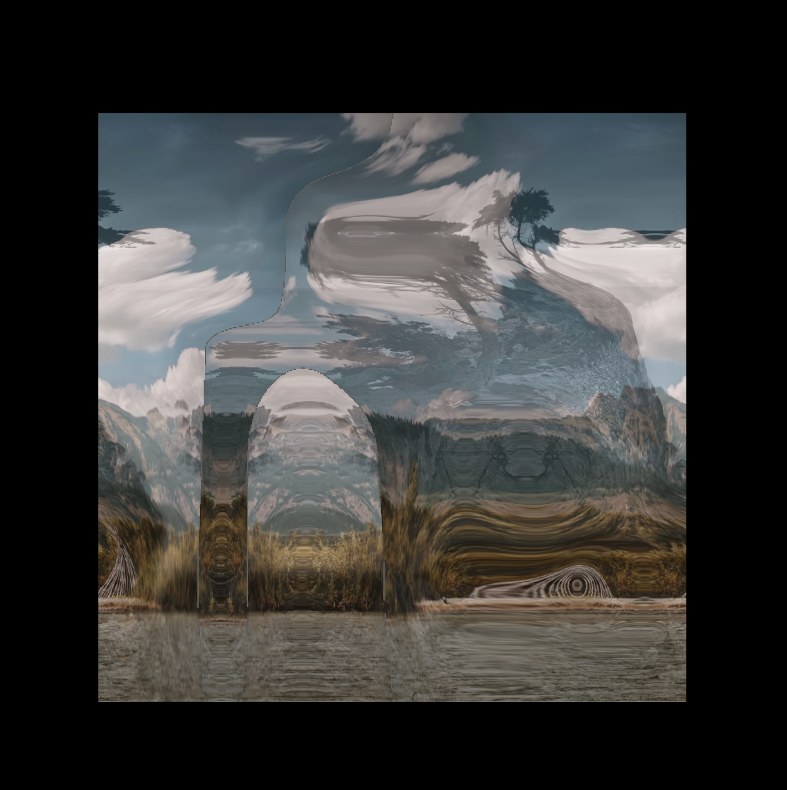
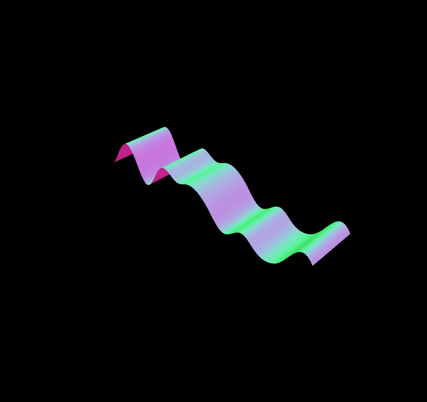
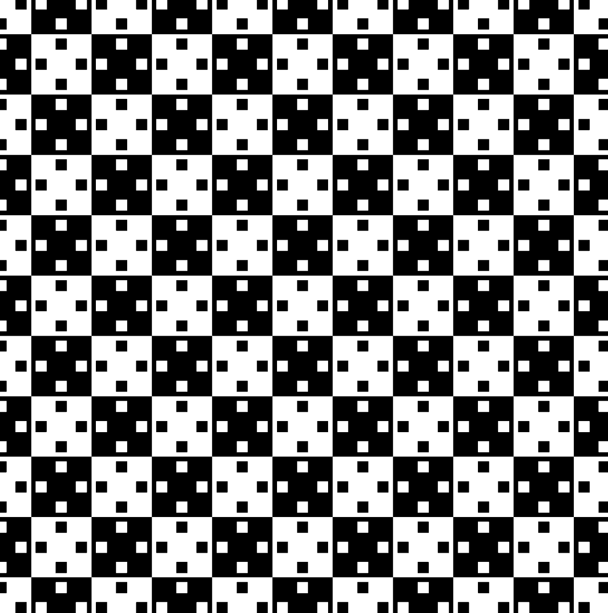

# Three JS Workshops: Math for Creatives

[Three JS Workshops: Math for Creatives](https://threejs-workshops.com/workshop/math#1)

## Sin

## Sine to Gerstner Waves

## Sine Smooth Transitions

## Sine Texture Transitions

## Sine to Loop Noise

## Derivatives in Graphics
